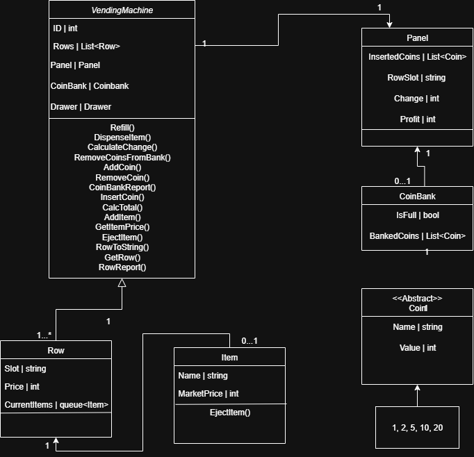

# Vending Machine (.NET 8, C# 12)

This project is a console-based vending machine simulation written in C# 12 for .NET 8. It demonstrates object-oriented design, repository/service patterns, and robust exception handling for a simple, interactive vending machine.

---

## Features

- Add and manage items in multiple vending machine rows
- Accept and validate coins (1, 2, 5, 10, 20 DKK)
- Calculate and dispense change
- Console-based user interface
- Coin bank and inventory reporting
- Exception handling for robust user experience

---

## Project Structure

- `Models/` – Core data models (Item, Row, Coin, etc.)
- `Repository/` – Data access and business logic (IVendingMachineRepo, VendingMachineRepo)
- `Service/` – Service layer for business operations (VendingMachineService)
- `Program.cs` – Console application entry point

---

## Getting Started

### Prerequisites

- [.NET 8 SDK](https://dotnet.microsoft.com/download/dotnet/8.0)

### Build and Run

### Usage

1. Start the application.
2. View available items and coin bank status.
3. Select a row to purchase from.
4. Insert coins as prompted.
5. Receive your item and any change.

---

## Class Diagram

Below is the class diagram for the project:

---

## License

This project is licensed under the MIT License.
